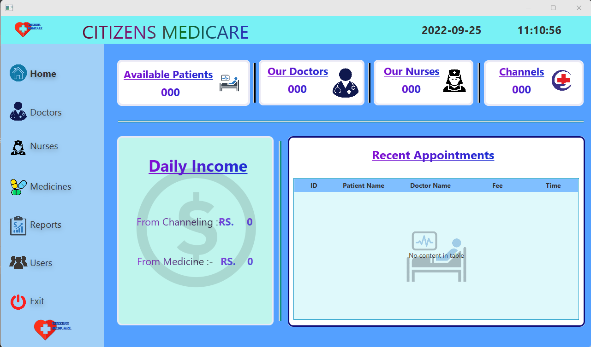
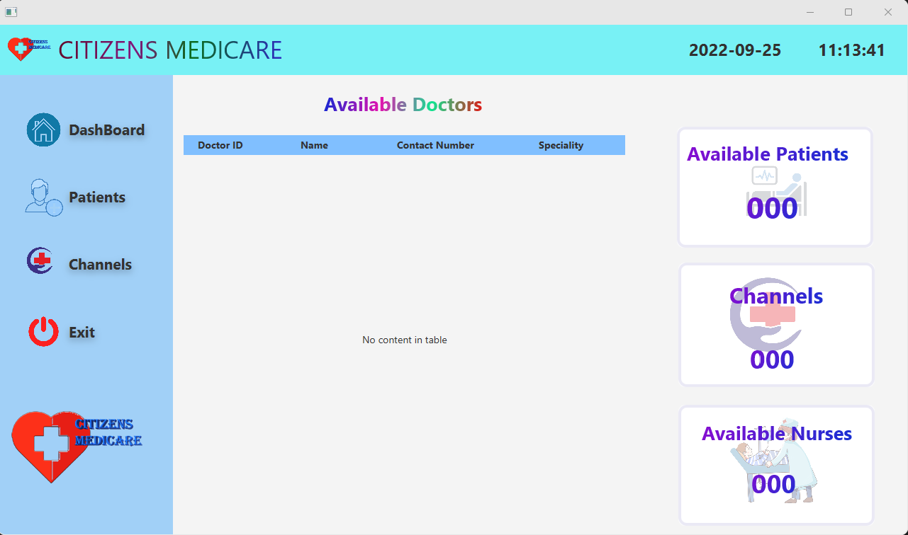
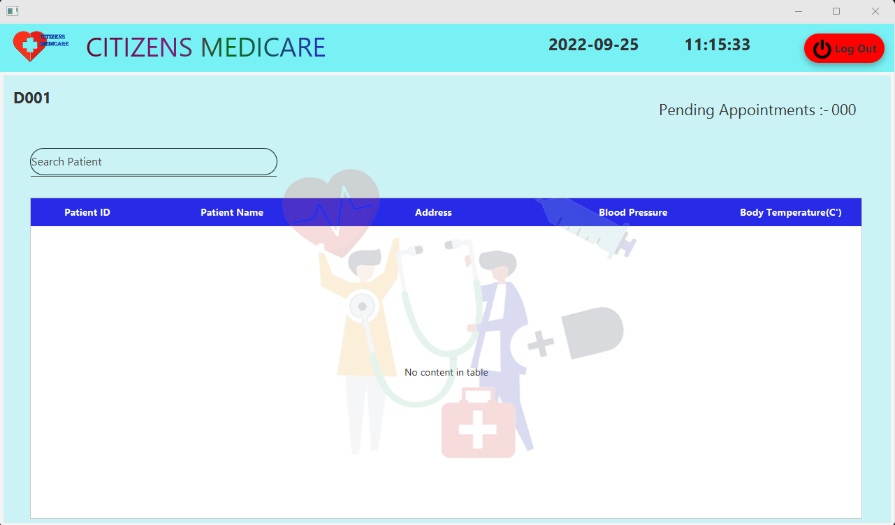
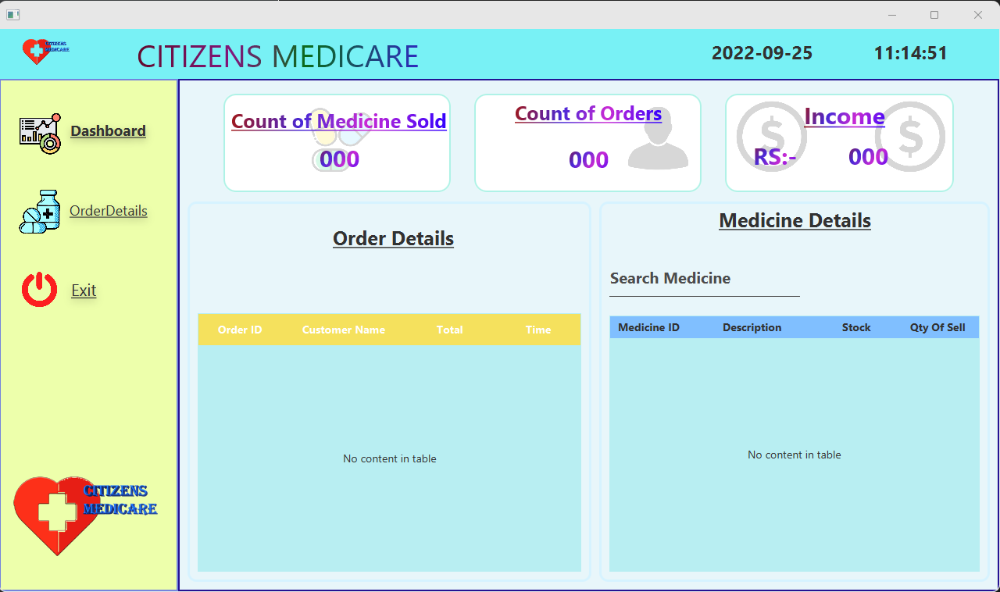
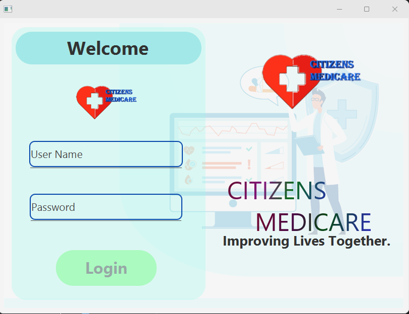

# Citizen-medicare
# Medical Center and Pharmacy Management System

- I designed and created this System for small size medical center and pharmacy
  - 
  - Advantages Of This System
    - 
      - Patient can make call and add an appointment to meet doctor.
        -  
      - Admin Can Manage Details of Doctors,Nurses,Medicines and Users. also admin can view monthly and yearly income reports. 
        - 
      - Using This System Doctors can view their Patients Details and their appointments.
        - 
      - Reception can manage details of Patients and Channels.
        -  
  - The User interfaces of this system are as follows
    - 
    - Admin Page
      
    - Reception Page
      
    - Doctor Page
      
    - Pharmacy Page
      
    - Login Page
      
        